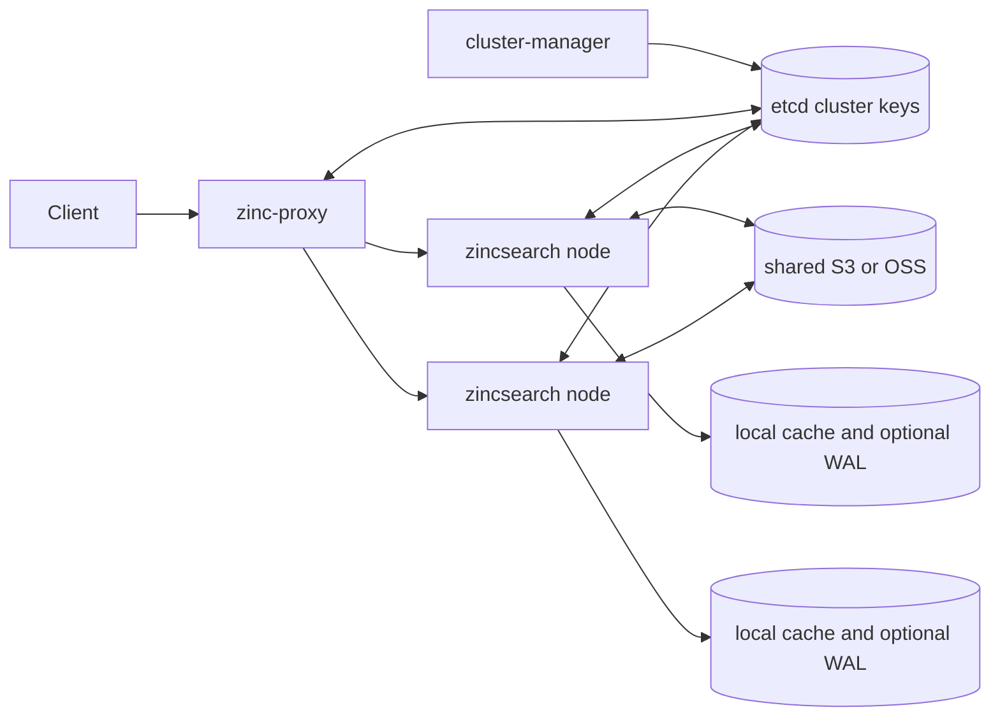

# Architecture

> **Purpose:** Describe SeaSearch system boundaries, deployment modes, major components, and dependency direction.
> **Last verified:** 2026-09-18
> **Verified against commit:** `c914b4cc84f87197c03009bafefc06f3f513700b`
> **Relevant source paths:** `cmd/zincsearch/main.go`, `cmd/zinc-proxy/`, `cmd/cluster-manager/`, `pkg/core/`, `pkg/cluster/`, `pkg/metadata/`, `pkg/bluge/`, `go.mod`

## System Boundary

SeaSearch is a Go search service with native and Elasticsearch-compatible HTTP APIs, full-text indexes built on a forked Bluge stack, and Flat/IVFPQ/HNSW vector indexes. It can run as one compute process or as a cluster of three process types: compute nodes share application metadata and object storage, the proxy reads application metadata and cluster topology, and the manager uses cluster topology only (`cmd/zincsearch/main.go` `main`; `cmd/zinc-proxy/main.go` `main`; `cmd/cluster-manager/manager.go` `InitClusterManger`; `pkg/core/vec_index.go` `MakeVecIndex`).

The root `main.go` is only a placeholder package for Go package patterns; it is not an executable. Runtime entry points live under `cmd/` (`main.go`; `cmd/zincsearch/main.go`; `cmd/zinc-proxy/main.go`; `cmd/cluster-manager/main.go`).

## Deployment Modes

| Concern | Standalone | Cluster |
|---|---|---|
| HTTP compute/API | One `zincsearch` process | One or more `zincsearch` compute nodes |
| Metadata | Local bbolt by default; optional Badger | Shared etcd under `<prefix>/metadata` |
| Text/vector storage | Local disk by default | Intended shared S3 or OSS, with node-local cache |
| Routing | Direct to compute process | `zinc-proxy` routes by partition ownership |
| Ownership management | Not used | `cluster-manager` balances 256 index-name hash prefixes |

Backend selection is implemented by `pkg/metadata/storage.go` `InitMetaStorage` and `pkg/core/newindex.go` `getOpenConfig`. Cluster ownership checks are implemented by `pkg/cluster/cluster.go` `AssignCheck`, proxy `cmd/zinc-proxy/proxy.go` `GetAddrByIndex`, and manager `cmd/cluster-manager/manager.go` `distribute`.

In standalone mode, the proxy, manager, etcd cluster keys, and shared object store are not required (`pkg/config/config.go` `cluster.Enable`; `pkg/cluster/cluster.go` `Init`).

## Responsibility Layers

| Layer | Ownership | Evidence |
|---|---|---|
| HTTP composition | Gin middleware and route registration | `pkg/routes/setup.go` `Setup`; `pkg/routes/routes.go` `SetRoutes` |
| HTTP adaptation | Request binding and response rendering | `pkg/handlers/auth/`, `pkg/handlers/document/`, `pkg/handlers/index/`, `pkg/handlers/search/` |
| Search/index runtime | Index catalog, shards, commits, search fan-in, vectors | `pkg/core/` types `Index`, `IndexShard`, `IndexSecondShard` |
| Query translation | DSL normalization, Bluge query creation, aggregation and result options | `pkg/uquery/` `NormalizeQuery`, `ParseQueryDSL` |
| Text engine integration | Search merging, analyzers, storage directories | `pkg/bluge/`; `pkg/bluge/search/search.go` `MultiZincSearch` |
| Persistent metadata | Typed repositories over Bolt, Badger, or etcd | `pkg/metadata/`; `pkg/metadata/storage/storage.go` `Storager` |
| Cluster control | Heartbeats/watches, proxy routing, partition balancing | `pkg/cluster/`; `cmd/zinc-proxy/`; `cmd/cluster-manager/` |
| Durability/cache | Optional WAL and local remote-object cache | `pkg/wal/`; `pkg/lru_cache/` |

## Core Data Shape

An index has one fixed first-layer shard in current creation code, selected by rendezvous hashing of document IDs. Each first-layer `core.IndexShard` owns an optional WAL and an ordered list of physical `core.IndexSecondShard` Bluge stores. A new second shard is appended after the latest exceeds the configured size (`pkg/core/newindex.go` `NewIndex`; `pkg/core/index_shards.go` `CheckShards`, `NewShard`).

Vector fields are persisted separately from Bluge documents. `meta.VecIndex` records vector type and segments; concrete implementations are `core.FlatIndex`, `core.IvfPqIndex`, and `core.HNSWIndex` (`pkg/meta/index.go` `VecIndex`; `pkg/core/vec_index.go` `MakeVecIndex`).

## Key Dependencies

- `go.mod` replaces upstream Bluge, segment API, and Ice modules with SeaFile/ZincSearch forks. Behavior may differ from upstream documentation.
- Gin owns HTTP routing (`pkg/routes/`).
- etcd stores cluster metadata and, in cluster mode, application metadata (`pkg/metadata/storage/etcd/`; external `github.com/haiwen/goutils/clusterkit`).
- FAISS and USearch are native vector dependencies (`faiss_wrapper/`; `pkg/core/hnsw_segment.go`; `go.mod`).
- S3/OSS clients back remote text and vector objects (`pkg/bluge/directory/`; `pkg/core/vector/vec_storage.go`).

## Trust and Consistency Boundaries

- Metadata CRUD exposes no cross-record transaction or compare-and-swap through `pkg/metadata/storage/storage.go` `Storager`.
- Disk and object Bluge directory locks are no-ops; single-writer correctness relies on routing and current ownership (`pkg/bluge/directory/disk.go` `Lock`, `Unlock`; corresponding S3/OSS directory methods).
- Cluster failover moves ownership, not physical data. Shared storage must be readable by every query node; internal search reconstructs runtime indexes from shared metadata (`cmd/cluster-manager/manager.go` `updateAssigns`; `pkg/core/loadindexes.go` `GetZincIndexFromMetadata`, `formatIndex`; `pkg/handlers/search/search_v2.go` `InternalUnifiedSearch`).
- Local disk WAL is not transferred on ownership change (`pkg/wal/wal.go` `Open`; `pkg/core/index_shards_wal.go` `OpenWAL`).

## Verify Before Changing

- Exact etcd lease/key/watch semantics live partly in external `clusterkit`; inspect the pinned dependency before changing cluster protocol assumptions.
- Bluge snapshot publication and item extensions live in replaced dependencies; inspect those forks before changing object consistency assumptions.
- S3-compatible consistency and deployment access are operational contracts, not verified by this repository.
