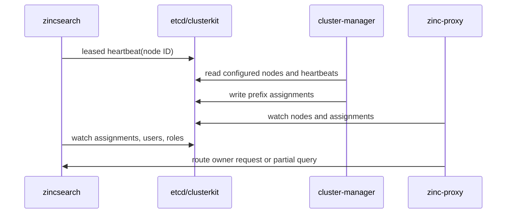

# Processes

> **Purpose:** Map executable entry points, process responsibilities, lifecycle, and interactions.
> **Last verified:** 2026-09-18
> **Verified against commit:** `c914b4cc84f87197c03009bafefc06f3f513700b`
> **Relevant source paths:** `cmd/zincsearch/main.go`, `cmd/zinc-proxy/`, `cmd/cluster-manager/`, `pkg/cluster/`, `pkg/routes/`

## Executables

| Process | Entry point | Default listen address | Responsibility |
|---|---|---|---|
| SeaSearch compute/API | `cmd/zincsearch/main.go` `main` | `:4080` | Owns index runtime, HTTP APIs, text/vector reads and writes, metadata, optional WAL |
| Cluster proxy | `cmd/zinc-proxy/main.go` `main` | `0.0.0.0:4082` | Routes by ownership and fans out eligible bulk/search/vector work |
| Cluster manager | `cmd/cluster-manager/main.go` `main` | `0.0.0.0:4081` | Stores node definitions and balances 256 ownership partitions among live nodes |

`AGENTS.md` names these process boundaries. The root `main.go` is not a fourth process.

## Compute Lifecycle

`cmd/zincsearch/main.go` `main` initializes in dependency order:

1. `config.InitConfig`, logging, `ider.InitIder`, `metadata.InitMetaStorage`, and `auth.InitFirstUser`.
2. GSE analysis, telemetry, Sentry, and profiling.
3. `cluster.Init` and `lru_cache.Init`.
4. `core.InitIndexList`, `core.InitVecIndexManager`, and `auth.Init`.
5. Async metadata updates; if enabled, `core.InitWalList` and `wal.Init`.
6. `routes.Setup` and the HTTP server, optionally with TLS 1.2 or newer.

The ordering is significant: metadata precedes users/indexes; cluster state and cache precede index loading; vectors and WAL start before serving requests (`cmd/zincsearch/main.go` `main`).

On first `SIGINT`/`SIGTERM`, HTTP gets up to 60 seconds to drain; `SIGQUIT` closes it without graceful drain. Cleanup closes indexes, metadata updater, index watcher, vector manager, auth, cluster, cache, metadata, and optional WAL. A second signal exits directly (`cmd/zincsearch/main.go` `shutdown`).

## Proxy Lifecycle

`cmd/zinc-proxy/main.go` `main` loads proxy config, initializes logs, opens shared etcd metadata, initializes IDs, then calls `InitProxy` and `StartProxy`. `StartProxy` opens `clusterkit` and starts node and assignment watches (`cmd/zinc-proxy/proxy.go` `StartProxy`, `syncClusterNodes`, `syncAssigns`).

`SetupHttp` registers mirrored compute APIs plus specialized fanout handlers (`cmd/zinc-proxy/http.go` `SetupHttp`). Shutdown drains HTTP, stops proxy watches, closes `clusterkit`, then closes metadata (`cmd/zinc-proxy/main.go` `shutdown`; `cmd/zinc-proxy/proxy.go` `ShutDownProxy`).

## Manager Lifecycle

`cmd/cluster-manager/main.go` `main` loads manager config, initializes logging/routes, and calls `InitClusterManger`. The manager opens `clusterkit`; `watchCluster` runs assignment updates on a 15-second timer (`cmd/cluster-manager/manager.go` `InitClusterManger`, `watchCluster`). The first rebalance is therefore timer-delayed rather than immediate.

Shutdown drains HTTP and signals the manager watcher before closing `clusterkit` (`cmd/cluster-manager/main.go` `shutdown`; `cmd/cluster-manager/manager.go` `ShutDownClusterManager`).

## Cluster Interaction

An index maps to the first two hex characters of its MD5 digest. The manager distributes all `00` through `ff` prefixes; the proxy resolves prefix to node URL; the compute node independently rejects non-owned ordinary index requests (`cmd/cluster-manager/manager.go` `distribute`; `cmd/zinc-proxy/proxy.go` `getAssignNodeByIndex`; `pkg/cluster/cluster.go` `AssignCheck`; `pkg/routes/middleware.go` `ClusterMiddleware`).

Eligible large searches can execute read-only work on non-owner nodes via internal APIs. These nodes reconstruct indexes from shared metadata/storage rather than taking write ownership (`cmd/zinc-proxy/parallel_query.go` `calcNodeIndexMap`; `pkg/core/loadindexes.go` `GetZincIndexFromMetadata`, `formatIndex`; `pkg/handlers/search/search_v2.go` `InternalUnifiedSearch`).

## Process Boundaries and Caveats

- The proxy reads users, roles, templates, and index metadata directly from shared etcd for locally handled/fanout work (`pkg/metadata/storage.go` `InitMetaStorageForProxy`). Proxy search routes do not install compute `IndexAliasMiddleware`; verify alias behavior through the proxy (`cmd/zinc-proxy/http.go` `SetupHttp`; `cmd/zinc-proxy/search.go` `SearchDSL`).
- The manager does not initialize application metadata or indexes (`cmd/cluster-manager/main.go` `main`).
- Proxy and manager HTTP servers do not configure TLS or server read/write/idle timeouts in their entry points (`cmd/zinc-proxy/main.go`; `cmd/cluster-manager/main.go`).
- Cluster manager API security is documented in [APIs](apis.md#manager-api-boundary); deployment-level protection must be verified.
- No leader election is visible in manager code. Run topology and concurrent-manager expectations require deployment verification (`cmd/cluster-manager/manager.go` `watchCluster`).
