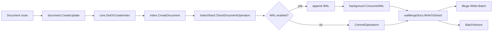

# Request Flows

> **Purpose:** Trace major end-to-end control and data flows through routes, handlers, core runtime, and storage.
> **Last verified:** 2026-09-18
> **Verified against commit:** `c914b4cc84f87197c03009bafefc06f3f513700b`
> **Relevant source paths:** `pkg/routes/`, `pkg/handlers/`, `pkg/core/`, `pkg/uquery/`, `pkg/bluge/search/`, `cmd/zinc-proxy/`

## Common HTTP Path

Compute requests enter `pkg/routes/setup.go` `Setup`, which installs recovery, access logging, pprof, optional Prometheus, CORS, and routes. Protected routes use HTTP Basic authentication through `pkg/routes/middleware.go` `AuthMiddleware`; index-scoped cluster routes additionally use `ClusterMiddleware` (`pkg/routes/routes.go` `SetRoutes`).

## Index Creation

```text
route -> handlers/index.Create or CreateES
      -> CreateIndexWorker
      -> core.NewIndex
      -> settings/analyzers/mappings
      -> core.StoreIndex
      -> metadata.Index.Set + core.ZINC_INDEX_LIST.Add
```

`CreateIndexWorker` resolves the index name, checks cluster ownership and existence, and parses analyzers/mappings. `core.NewIndex` applies templates before explicit settings/mappings and creates initial shard metadata (`pkg/handlers/index/create.go` `CreateIndexWorker`; `pkg/core/newindex.go` `NewIndex`, `StoreIndex`).

Mapping updates use `pkg/handlers/index/mapping.go` `SetMapping` and `core.Index.SetMappings`. Vector properties create `meta.VecIndex` metadata with an initial growing segment (`pkg/core/index.go` `SetMappings`).

## Document Write



The handler chooses a supplied/path/generated ID. `Index.CreateDocument` selects a first shard and locates the existing second shard for updates. `CheckDocumentOperation` flattens JSON, infers/validates mappings, validates vector dimensions, and builds an internal operation (`pkg/handlers/document/create_update.go` `CreateUpdate`; `pkg/core/index_document.go` `CreateDocument`; `pkg/core/index_shards_document.go` `CheckDocumentOperation`).

`walMergeDocs.WriteToShard` merges repeated actions, writes Bluge batches, removes stale copies, and sends vector mutations to `BatchVectors` (`pkg/core/index_shards_wal.go` `walMergeDocs.WriteToShard`, `BatchVectors`). Vector fields are stored outside the Bluge document; vector-enabled indexes require canonical base62 integer document IDs (`pkg/core/index_document.go` `CreateDocument`).

## Bulk Write

Native and ES NDJSON routes converge on `pkg/handlers/document/bulk.go` `BulkWorker`. It scans action/data lines up to `config.Global.MaxDocumentSize`. With WAL enabled it invokes per-document operations; otherwise it groups operations by index and calls `Index.CreateDocuments`/`DeleteDocuments`, which group by first shard and commit with bounded concurrency (`pkg/handlers/document/bulk.go` `Bulk`, `ESBulk`, `BulkWorker`; `pkg/core/index_document.go` `CreateDocuments`, `DeleteDocuments`).

The proxy parses bulk bodies, keeps each action with its document line, groups by owner URL, and fans out (`cmd/zinc-proxy/bulk.go` `Bulk`, `processBody`). A failed destination fails the aggregate operation; there is no alternate owner retry in this path.

## Text Search

```text
native SearchV1 or ES SearchDSL
  -> V1 conversion or searchIndex
  -> Index.Search / core.MultiSearch
  -> uquery.NormalizeQuery + ParseQueryDSL
  -> time-range shard pruning
  -> SimpleSearcher lazy Bluge readers
  -> bluge/search.MultiZincSearch
  -> merge hits and aggregations; fields/highlights/source
```

Native V1 requests are converted by `pkg/uquery/query_dsl_from_v1.go` `ParseQueryDSLFromV1`. ES DSL requests use `pkg/handlers/search/search_v2.go` `SearchDSL`, with `core.MultiSearch` for multiple/wildcard indexes (`pkg/handlers/search/search_v1.go` `SearchV1`; `pkg/handlers/search/search_v2.go` `searchIndex`).

`Index.SearchWithStats` normalizes and compiles the query, extracts time range, selects relevant second shards, and calls `MultiZincSearch`. Multi-reader execution searches concurrently and heap-merges globally ordered hits and aggregation buckets (`pkg/core/search.go` `SearchWithStats`; `pkg/core/multi_search.go` `MultiSearch`; `pkg/bluge/search/search.go` `MultiZincSearch`).

## Distributed Text Search

For eligible one-first-shard indexes with enough second shards, proxy `calcNodeIndexMap` assigns second shards round-robin across up to `SS_PARALLEL_QUERY_NODE_LIMIT` configured nodes. When multiple nodes participate, it gathers term/collection statistics from `/api/internal/get_stats`, calls `/api/internal/unified_search`, then merges total hits, maximum score, and hits before score-sorting and truncating. `execParallelQueries` does not merge aggregation fields, and its `Took` value comes from the last response to acquire the merge lock (`cmd/zinc-proxy/parallel_query.go` `calcNodeIndexMap`, `parallelGetStats`, `execParallelQueries`).

Compute internal handlers use `core.QueryStatsInfoWithSecondShardIds` and `Index.PartialSearch`. `core.UnifiedSearcher` substitutes cluster-wide statistics so scores are comparable (`pkg/handlers/search/search_v2.go` `InternalQueryStats`, `InternalUnifiedSearch`; `pkg/core/multi_search.go`; `pkg/core/searcher.go` `UnifiedSearcher`).

## Vector Search

`pkg/handlers/search/search_vector.go` `SearchVector` validates mappings and dimensions, then calls `core.VectorSearch`. Each target vector index executes nearest-neighbor search, optionally restricted by IDs from a text filter query. Distances are merged globally; Bluge IDs queries retrieve document sources; score is `1 / (1 + distance)` (`pkg/core/vector_search.go` `VectorSearch`, `searchVector`, `retrieveVectorDocuments`).

The proxy distributes only eligible IVFPQ segment searches. It calls `/api/internal/vector_search`, merges ID-to-distance maps, then performs distributed text IDs retrieval (`cmd/zinc-proxy/vector.go` `SearchVector`, `calcNodeSegmentsMap`; `pkg/handlers/search/search_vector.go` `InternalSearchVector`). Flat and HNSW searches are routed to the owner.

## Assignment Change

The manager rewrites changed prefix assignments. Compute `pkg/cluster/cluster.go` `updateAssigns` replaces its ownership map and notifies `core.watchIndexUpdate`. That loop closes/removes unassigned runtime indexes, scans metadata, and loads newly assigned indexes (`pkg/core/indexlist.go` `watchIndexUpdate`, `updateIndexList`; `pkg/core/loadindexes.go` `LoadZincIndexesFromMetadata`).

This is not a transactional handoff: there is no request-drain acknowledgment, ownership epoch, storage lock, or replica promotion in these flows. Verify behavior carefully when changing reassignment (`pkg/core/indexlist.go`; `cmd/cluster-manager/manager.go`).
